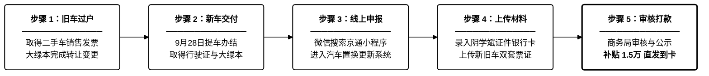

# 小米澎程N70 选定购车支付执行路线

> 🌐 **在线交互版（支持移动端/暗色模式/验车清单打勾）**：[https://amasun.github.io/n70-car-plan/](https://amasun.github.io/n70-car-plan/)  
> **车辆标的**：小米澎程N70（售价：**¥233,900**）  
> **提车时间**：**2026 年 9 月 28 日**（全车款已全额交清）  
> **核心路线**：**消费贷签约 ¥15 万（60期等额本息，年化 3.0% 单利，随借随还无违约金）+ 借出当日闪还 ¥5 万（在贷本金降为 ¥10 万）+ 月供保持 ¥2,695.30 不变（缩短至 39 期还清，总利息由 ¥11,718 骤降至 ¥5,077，立省 ¥6,641）+ 2027 年 2 月年终奖提前全额结清备选（利息仅需 ¥1,189）**

---

## 一、 资金出资与贷款执行配比

* **全款已提前交清（纯全款客户身份锁定）**：
  * 裸车车款及落地相关费用已用自有资金及贷款全额付清。
  * 对小米汽车而言为**100% 纯全款客户**，无任何金融服务费、出库费或公证杂费，**提车当天机动车登记证书（大绿本）直接自己带走自持**，无任何第三方抵押登记。
  * 支付后家庭仍留存充足备用现金，稳居 13.3 万元家庭 6 个月应急红线之上。

* **银行消费贷款（签约 15 万 ➔ 当日还 5 万 ➔ 实际在贷 10 万元）**：
  * **签约条件**：本金 **¥150,000 元**，期限 **60 个月（5 年）**，年化利率 **3.0% 单利**（月利率 0.25%），支持随时无违约金提前结清。
  * **借出当日实操**：**借出当天立即归还 ¥50,000 元本金**，实际计息在贷本金直接降为 **¥100,000.00 元**。
  * **还款策略选择（缩短期限）**：**每期月供保持不变（¥2,695.30 元/月）**，银行系统自动将总还款期数由 60 期压缩至 **39 期（约 3 年零 3 个月）**，提前 21 个月结清。
  * **利息与省息全景**：
    * 若原 15 万借满 60 期：总利息为 **¥11,718.22 元**；
    * 当天还 5 万后按 39 期正常还完：总利息骤降至 **¥5,077.21 元**，直接**节省利息支出 ¥6,641.01 元**（利息成本砍掉 56.7%）；
    * 若选择在 **2027 年 2 月（第 5 个月）** 年终奖到账提前全额结清：累计已付利息仅 **¥1,188.71 元**，本金即可全部清零！

---

## 二、 逐月执行路线图（2026.09 ~ 2027.02）

### 阶段执行与资金全景图

```mermaid
%%{init: {
  'theme': 'base',
  'themeVariables': {
    'fontSize': '14px',
    'primaryColor': '#ffffff',
    'primaryTextColor': '#000000',
    'primaryBorderColor': '#000000',
    'lineColor': '#000000',
    'textColor': '#000000'
  }
}}%%
flowchart LR
    T0["<b>T0 · 09.28 交付</b><br>──────────────<br>借15万 当天还5万<br>实际在贷 10.0万<br>全款已交 · 大绿本自持<br><b>剩余本金：¥100,000</b>"]
    
    T1["<b>T1 · 2026.10</b><br>──────────────<br>月供 <b>¥2,695</b><br>月薪轻松覆盖<br><b>剩余本金：¥97,555</b>"]

    T2["<b>T2 · 2026.11</b><br>──────────────<br>月供 <b>¥2,695</b><br>公积金到账 <b>+2.58万</b><br><b>剩余本金：¥95,103</b>"]

    T3["<b>T3 · 2026.12</b><br>──────────────<br>月供 <b>¥2,695</b><br>月薪覆盖 · 定投照常<br><b>剩余本金：¥92,646</b>"]

    T4["<b>T4 · 2027.01</b><br>──────────────<br>月供 <b>¥2,695</b><br>月薪覆盖 · 资金蓄水<br><b>剩余本金：¥90,182</b>"]

    T5["<b>T5 · 2027.02 结清</b><br>──────────────<br>年终奖到账 · 一键还清<br>总利息仅 <b>¥1,189</b><br><b>剩余本金：¥0 (结清)</b>"]

    T0 --> T1 --> T2 --> T3 --> T4 --> T5

    classDef wireframe fill:#ffffff,stroke:#000000,stroke-width:1.5px,color:#000000,rx:4px,ry:4px;
    classDef wireframeTerminal fill:#ffffff,stroke:#000000,stroke-width:2.5px,color:#000000,rx:4px,ry:4px;

    class T0,T1,T2,T3,T4 wireframe;
    class T5 wireframeTerminal;
```

---

### 还款与结清现金流明细表

#### 方案 A：2027 年 2 月年终奖提前全额结清（推荐路线）

| 阶段 / 时间 | 核心动作与资金流 | 月供明细 (本金 + 利息) | 剩余本金 | 本金偿还进度 | 现金流状态与执行说明 |
| :---: | :--- | :---: | :---: | :---: | :--- |
| **T0：2026-09-28** | **提车交付与贷款实操** • 全车款已提前付清 • 消费贷借 15 万，当天还 5 万，在贷 10 万 | —— | ¥100,000.00 | `░░░░░░░░░░` 0.0% | 对小米而言为**纯全款客户**，无抵押，大绿本直接归自己自持。 |
| **T1：2026-10** | **第 1 期月供扣款** | **¥2,695.30** (本 2,445.30 + 息 250.00) | ¥97,554.70 | `█░░░░░░░░░` 2.4% | 月薪结余轻松覆盖，开启首期供款。 |
| **T2：2026-11** | **第 2 期月供扣款** | **¥2,695.30** (本 2,451.41 + 息 243.89) | ¥95,103.29 | `█░░░░░░░░░` 4.9% | 当月季度公积金到账（+¥25,782），现金池大幅回血，还款完全无感。 |
| **T3：2026-12** | **第 3 期月供扣款** | **¥2,695.30** (本 2,457.54 + 息 237.76) | ¥92,645.74 | `█░░░░░░░░░` 7.4% | 税后月薪盈余覆盖，每月 ¥8,000 指数基金定投照常扣划。 |
| **T4：2027-01** | **第 4 期月供扣款** | **¥2,695.30** (本 2,463.69 + 息 231.61) | ¥90,182.06 | `█░░░░░░░░░` 9.8% | 正常月薪结余覆盖，资金稳步累积，静待次月年终奖发放。 |
| **T5：2027-02** | **全额提前结清** • 结清当期利息 ¥225.46 • 一键还清剩余本金 **¥90,182.06** | **¥90,407.52** (本 90,182.06 + 息 225.46) | **¥0.00** *(彻底结清)* | `██████████` 100% | **年终奖（15~18万）+ 公积金（2.58万）集中到账**，手机银行 App 申请提前还款，一次性无损结清。 |
| **5个月结清汇总** | **实际总支出：¥101,188.71** | **总利息仅支出：¥1,188.71** | **在贷总本金：¥100,000.00** | **综合资金成本** | **仅花 1,189 元利息代价，换取了全家 5 个月极其充裕的现金流动性自由。** |

---

#### 方案 B：按 ¥2,695.30 月供正常还满 39 期（不提前结清对比）

如果中途不提前结清，每月按 ¥2,695.30 正常还款，总还款期数由原 60 期自动缩短至 **39 期（提前 21 个月结清）**：

| 还款阶段 / 里程碑 | 每月还款额 | 当期本金 / 利息 | 累计已付利息 | 剩余借款本金 | 状态说明 |
| :---: | :---: | :---: | :---: | :---: | :--- |
| **第 1 期（2026.10）** | ¥2,695.30 | 本 2,445.30 / 息 250.00 | ¥250.00 | ¥97,554.70 | 首期供款 |
| **第 12 期（1年整）** | ¥2,695.30 | 本 2,513.56 / 息 181.74 | ¥2,593.14 | ¥70,249.54 | 剩余本金约 7 万元 |
| **第 24 期（2年整）** | ¥2,695.30 | 本 2,590.00 / 息 105.30 | ¥4,281.40 | ¥39,594.20 | 剩余本金不足 4 万元 |
| **第 36 期（3年整）** | ¥2,695.30 | 本 2,668.79 / 息 26.51 | ¥5,037.24 | ¥8,006.44 | 剩余本金约 8 千元 |
| **第 38 期（2029.11）** | ¥2,695.30 | 本 2,681.98 / 息 13.33 | ¥5,070.59 | ¥2,649.04 | 倒数第二期 |
| **第 39 期（2029.12）** | **¥2,655.67** | 本 2,649.04 / 息 6.62 | **¥5,077.21** | **¥0.00** | **本息彻底结清（提前21个月）** |
| **39期还满汇总** | **总还款：¥105,077.21** | **总利息：¥5,077.21** | **相比原15万60期方案立省利息：¥6,641.01 元** |

---

## 三、 落地实操必核清单

### 1. 银行端（贷后与还款跟踪）
1. **确认借出当日还款生效**：确认首日还款的 ¥50,000 已全额抵扣本金，App 内显示剩余借款本金为 **¥100,000.00**。
2. **核对还款计划表**：在手机银行 App 中核对还款计划，确认当前执行状态为**“月供约 ¥2,695.30，总期数缩减为 39 期”**。
3. **保留还款凭证与借款合同**：确认合同中注明“支持随时提前还款、无违约金”。
4. **留存发票备查**：28 号提车后开具的《机动车销售统一发票》拍照并保存电子版，备查消费贷贷后资金用途核验。

### 2. 小米交付端（9月28日提车日）
1. **身份界定**：向交付顾问明确是 **“纯全款购车”**（车款已全额交清）。
2. **费用底线**：**不支付** 任何金融服务费、出库费、公证费或上牌代办高额溢价。
3. **收件核查**：
   * **机动车登记证书（大绿本）**：原件由自己带走，现场核实无任何抵押登记记录。
   * **机动车销售发票**：核对发票联、报税联、注册登记联齐全，发票抬头必须为指标人**阴学斌**。

---

## 四、 提车实操验车检验清单

### 1. 证件与随车附件核查（法律与权属）

| 检验类目 | 核验要点与标准 | 状态 |
| :--- | :--- | :---: |
| **三码一致性** | 核对**车辆合格证**、**车架铭牌（B柱）**、**挡风玻璃左下角 VIN 码**与**销售发票**上的车架号完全一致。 | `[ ]` |
| **票证完整性** | 机动车销售统一发票（发票联/报税联/注册登记联）、车辆一致性证书、环保清单、三包凭证。 | `[ ]` |
| **钥匙与配对** | 实体遥控钥匙 2 把、NFC 卡片钥匙 2 张、手机 App 蓝牙数字钥匙激活配对正常。 | `[ ]` |
| **随车应急工具** | 三角警示牌、反光背心、随车充气泵/补胎液、牵引钩、便携式放电设备（如有赠送/选配）。 | `[ ]` |
| **临时牌照** | 临牌信息核对（车架号、车主姓名），确认临牌在有效期限内（建议至少覆盖 15 天以上）。 | `[ ]` |

### 2. 车身外观与装配工艺（顺光/逆光仔细排查）

| 检验类目 | 核验要点与标准 | 状态 |
| :--- | :--- | :---: |
| **全车漆面** | 车辆必须停放在**光线充足处**或车间灯阵下；顺光与逆光观察前后杠、侧裙、四门折角是否有橘皮、色差、划痕、小凹坑或后补漆痕迹（可使用或要求交付顾问提供漆膜仪测厚，正常在 100~150μm 且分布均匀）。 | `[ ]` |
| **装配接缝** | 机舱盖两侧接缝、尾厢盖左右接缝、四门门缝对称度，缝隙公差应均匀一致，无肉眼可见的高低差或左右明显宽窄不一。 | `[ ]` |
| **全车玻璃** | 检查挡风玻璃、侧窗、全景天幕玻璃标识右下角的生产年月（圆点+数字），出厂月份应早于或接近整车出厂日期，玻璃表面无砂眼与划痕。 | `[ ]` |
| **轮胎与轮毂** | 四个轮毂边缘无运车蹭伤；核对轮胎品牌规格与选配一致；查验轮胎生产批次 DOT 代码（如 3226 代表 2026 年第 32 周）；检查四轮原始胎毛是否完好，胎压显示是否正常（冷态约 2.6~2.9 bar）。 | `[ ]` |

### 3. 座舱内饰与机械电气功能

| 检验类目 | 核验要点与标准 | 状态 |
| :--- | :--- | :---: |
| **座椅与皮革面料** | 真皮/翻毛皮座椅表面无折痕磨损、污渍或开线；主副驾电动调节、座椅通风、座椅加热、按摩功能逐项测试有效。 | `[ ]` |
| **车机与仪表屏** | 中控大屏、仪表屏、HUD 抬头显示表面无划痕；在纯白/纯黑壁纸下检查屏幕是否有坏点、亮点、漏光；触控响应流畅无卡顿。 | `[ ]` |
| **车窗与遮阳机构** | 四门车窗一键升降顺畅无异响、防夹手功能有效；全景天幕电动遮阳帘（如有）开合顺畅平整。 | `[ ]` |
| **空调与照明** | 空调冷风/热风制热制冷迅速，出风口扫风与分区温控正常，车内无异味；前后大灯、日行灯、刹车灯、车内氛围灯全功能点亮测试。 | `[ ]` |
| **储物与电动尾厢** | 手套箱、扶手箱开关阻尼正常；前后备箱电动开关、脚踢感应/按键闭锁测试顺畅无异响。 | `[ ]` |

### 4. 三电核心与网联功能（纯电专属）

| 检验类目 | 核验要点与标准 | 状态 |
| :--- | :--- | :---: |
| **出厂日期与里程** | 查验 B 柱车辆铭牌，出厂日期距交付日应在 **3 个月内**（严防超长库存车）；仪表初始总行驶里程应在 **10 ~ 50 km 内**（过高需查问转运原因）。 | `[ ]` |
| **电池电量状态** | 交付时动力电池电量（SoC）建议在 **60% 以上**（提前一天提醒交付顾问慢充充至 85% 以上）；车机健康度自检无任何三电故障报警代码。 | `[ ]` |
| **快慢充口机构** | 手动/电动按键打开快充口与慢充口，盖板阻尼正常，充电口针脚平直无氧化烧蚀痕迹。 | `[ ]` |
| **车主绑定与网联** | 现场完成车主账号登录与人车绑定，测试车载 5G 信号、车载 GPS 定位、手机 App 远程解锁/控温功能畅通。 | `[ ]` |

### 5. 交付签署避坑铁律

1. **瑕疵未定，严禁签字**：在外观、功能全项确认无误前，**严禁签署任何《车辆交付确认单》**，**严禁在手机 App 上点击“确认交付”**。
2. **问题书面留痕与工单锁定**：现场若发现任何划痕、色差或装配缝隙问题，必须由交付专员在交付纸质单据上手写签字记录，并在系统内正式提报售后工单。
3. **争取合理补偿与修复方案**：细微瑕疵若无需返修拒收，可争取官方商城积分（5,000~20,000 积分）、原厂配件（脚垫/天幕遮阳帘等）或常规保养券作为补偿后再行确认提车。

---

## 五、 9月28日 提车与上牌方案（双轨决策）

### 1. 时间优势与逻辑重构

* **提前至 9 月 28 日提车的重大利好**：
  * **避开节前排队洪峰**：相较于 9月30日（假期前最后一天）车管所爆满排队，**9月28日（周一/正常工作日）政务与车管窗口业务节奏平稳得多**。
  * **现场直出纸质临牌**：小米交付中心现场已设交管便民终端，提车现场即可直接打印核发纸质临时号牌（有效期限通常 15~30 天），**贴上临牌新车即可合法上路**。

| 决策路径 | 执行节奏 | 耗时评估 | 优劣势与适配场景 |
| :--- | :--- | :---: | :--- |
| **路线 A *(轻松从容：提车领临牌，国庆后错峰上牌)*** | 9月28日上午完成验车、开票、出险并**现场领取粘贴纸质临牌** ➔ 直接开新车回家 ➔ 整个国庆假期凭临牌无忧畅开自驾 ➔ **国庆节后（10月8日后）任意工作日半天完成验车选号上牌**。 | 全程约 **3.0 小时** *(上午半天即可)* | **最惬意解**：无需当日赶往车管所排队，提车节奏从容，国庆假期出行完全不受影响。 |
| **路线 B *(同日冲刺：9月28日当天冲刺正式号牌与大绿本)*** | 上午提车并领取临牌 ➔ 挂临牌自驾赴京北车管所完成外检拓号、选号并制作大绿本与行驶证 ➔ 当日全部办结回家。 | 全程约 **7.5 ~ 8.5 小时** *(08:30~17:00)* | **效率闭环**：由于 9月28日非假期前最后一天，车管所排队压力显著轻于 9月30日，当日冲刺成功率极高；即便遇拥堵也能凭临牌随时撤退。 |

---

### 2. 权属与代办核心确认

* **出资人与指标人界定**：实际出资买主为你本人，**指标人（法定车主）为阴学斌**。
* **发票与税单抬头**：机动车销售统一发票购买方、交强险被保险人、购置税申报人**必须统一登记为“阴学斌”**。
* **到场与委托授权（二选一）**：
  * **方案 A（最优）**：阴学斌本人持身份证原件一同前往交付中心（及车管所）。
  * **方案 B（代办）**：若阴学斌无法到场，**提前在“交管12123”App完成电子委托**（路径：`便民服务` ➔ `业务委托申请` ➔ `机动车业务 / 注册登记` ➔ 填写代办人信息并人脸核验），提车当天携带双方身份证原件及纸质委托书。

---

## 六、 汽车置换更新补贴申请全流程

### 1. 补贴类型与资金收益预估

| 补贴类别 | 申报主体 / 平台 | 预估补贴金额 | 发放形式 | 核心享受条件 |
| :--- | :--- | :---: | :--- | :--- |
| **北京市汽车以旧换新补贴** *(汽车置换更新补贴)* | 北京市商务局 “京通”小程序 / 汽车置换申报系统 | **¥15,000 元** *(新能源乘用车标准)* | 现金直达银行卡 *(打入阴学斌名下账户)* | 转出在北京市登记的个人名下旧乘用车，并在北京购买新能源新乘用车。 |
| **小米汽车官方置换礼遇** | 小米汽车 App / 交付中心 | **约 ¥3,000 ~ 5,000 元** *(以当季交付政策为准)* | 官方商城积分 / 保险补贴 / 选装基金 | 通过小米汽车官方置换渠道或提报外部二手车处置证明。 |
| **置换合计综合收益** | **政企联动双重回血** | **约 ¥18,000 ~ 20,000 元** | **综合资金回收** | **完全覆盖贷款利息（1,189~5,077元）后，仍能为家庭净增现金超 1.3 ~ 1.8 万元！** |

### 2. 资格与资料红线（必须严格同名同人）

* **“四合一”同名铁律**：
  * **旧车原所有人** = **阴学斌**
  * **新车发票购买方** = **阴学斌**
  * **新车行驶证及大绿本车主** = **阴学斌**
  * **接收补贴的银行借记卡（I类卡）账户名** = **阴学斌**
  * *(注：出资人为你本人无妨，但所有政策流转单据必须严格绑定指标人阴学斌。)*
* **必备材料清单**：
  1. 阴学斌身份证正反面原件照片。
  2. 旧车《二手车销售统一发票》（买方可为二手车商或个人，卖方必须为阴学斌）。
  3. 旧车原《机动车登记证书》（含本次转让转移登记信息的对应签章页）。
  4. 新车《机动车销售统一发票》（发票联彩色原件照片）。
  5. 新车《机动车行驶证》（主页与副页正反面彩色照片）。
  6. 新车《机动车登记证书》（第 1 页与第 2 页，登记所有人必须为阴学斌且无抵押）。
  7. 阴学斌名下 I 类银行借记卡（需明确开户行及支行名称）。

### 3. 申报步骤与实操路径

---

## 七、 小米汽车特色验车细节与车主实战避坑经验

### 1. 漆面与钣金公差特有通病（车友圈高频反馈）

* **前后杠与金属车身反光色差**：
  * **现象**：前后保险杠为工程塑料材质，车身侧面为金属材质。在阴天或昏暗室内展厅中，金属漆（如雅灰、海湾蓝等）可能呈现微弱折射色差。
  * **排查方法**：**切勿在昏暗展厅内验收**。务必将车辆开至室外日光下或强光灯阵下，后退 3~5 米从 45 度侧角观察前后杠拼接处反光一致性。
* **前机舱盖左右接缝与高低公差**：
  * **现象**：前机盖两侧接缝存在左右不对称（一宽一窄），或前边缘微高于保险杠平面。
  * **现场快修方案**：机舱盖底面配有**可旋转螺纹橡胶限位胶墩**。现场发现高低差时，**直接要求驻场售后技师微调胶墩螺纹**，通常 3~5 分钟即可完全找平，无需返厂。
* **轮毂装卸与运输暗伤**：
  * **排查方法**：长途板车运输时紧固绑带卡扣若操作不当，易在轮毂外凸边缘造成微擦痕。验车时不仅用肉眼看，更要**用手指顺着 4 个轮毂外边缘滑摸一圈**，排查有无毛刺、磕碰凹坑。

### 2. 无框车门与隔音密封细节

* **无框车窗短升降动作**：
  * **排查要点**：拉开外门把手瞬间，车窗应瞬间微降 1~1.5 cm；关门到位后玻璃须迅速向上顶紧切入顶框密封胶条。
  * **测试手法**：在车内逐门开关测试，感受关门时是否有玻璃松旷震颤声，并检查车窗上沿密封黑胶条是否平整、有无折叠挤压变形。
* **双模车门开关逻辑测试**：
  * 逐一测试车外微动按键开门、车内电子轻触开关开门，以及门板储物槽下方的**机械应急拉手**是否能正常物理拉动开门（核心逃生冗余）。

### 3. 小米澎湃 OS 与双人用车账号绑定（核心重点）

鉴于**“实际买主出资为你本人，但指标人与法定车主为阴学斌”**的权属架构，提车现场必须打通双人账号授权体系：

* **第一步：主车主账号绑定（必须为阴学斌）**：
  * 现场车机首发激活与小米汽车 App 主管理员，**必须登录阴学斌的小米账号（手机号）**完成人脸识别与车辆认证。
* **第二步：现场完成亲友权限授权与主驾绑定（必须现场做完）**：
  * **避坑要点**：由阴学斌手机端登录小米汽车 App ➔ 依次点击：`车辆管理` ➔ `亲友钥匙 / 车辆共享` ➔ 输入**你本人的手机号与小米账号**，授权赋予“全部控制权限”。
  * 随后在你本人手机端打开小米汽车 App，绑定手机蓝牙钥匙与 UWB 无感车钥匙功能，并完成驾驶座面部识别录入与座椅记忆绑定。**在交付专员在场时当场测试手机解锁、开锁、远程空调控车**，避免提车离场后再折腾远程核验。
* **第三步：物理钥匙与无线充电板排查**：
  * 在左侧 B 柱刷卡感应区测试 NFC 卡片钥匙解锁与落锁。
  * 手机放置于中控 50W 风冷无线充面板，测试充电触发灵敏度并确认底部散热出风口有无正常降噪出风（严防风扇卡死或虚焊）。

### 4. 提车前电量准备与随车配件

* **提前 1 天锁定交付电量**：
  * 交付中心默认交付电量有时仅 20%~30%，出场即面临找桩焦虑。
  * 提车前一日（9月27日）在交付群向交付专员明确要求：**“提车时请协助将动力电池慢充至 85% ~ 90% 以上”**。
* **车载螺纹扩展接口排查**：
  * 中控大屏四周配有小米标准螺纹扩展孔（用于手机支架、实体按键面板等），拆下硅胶塞检查内螺纹是否规整无滑丝、孔内无杂质堵塞。
* **家用充电桩服务卡包**：
  * 确认小米汽车 App 账户中已收到随车赠送的【7kW/11kW 家充桩权益兑换卡】或报装服务工单。

### 5. 现场微小瑕疵的“合理维权与积分补偿”潜规则

车友圈实战表明，若现场发现可修复的细微瑕疵，**切勿直接发火退订，也不要口头答应算了，应转化为实用权益**：

* **事实手写留痕**：
  * 若发现轻微抛光可去除的漆面发丝纹、皮革微小压痕或缝隙公差微调，要求交付专员在纸质《车辆交付确认单》上手写注明问题并签字。
* **主动索要小米商城积分或周边补偿**：
  * **合理索赔心理预期**：根据全国车主案例，交付专员权限内通常可向上申请 **5,000 ~ 20,000 小米商城积分（等值 ¥500 ~ 2,000 元，可在 App 兑换原厂脚垫、天幕遮阳帘、车载充气泵等车品）**，或直接赠送原厂周边（如户外放电枪、遮阳帘、定制保温杯等）。
* **把控 App 最终确认键**：
  * 交付专员需引导客户在手机 App 点击“确认提车”方可闭环考核。**在全部瑕疵处理或补偿方案书面落地前，手机 App 坚决不点最终确认**，保持现场平等的谈判支点。
