# 小米澎程N70 选定购车支付执行路线

> 🌐 **在线交互版（支持移动端/暗色模式/验车清单打勾）**：[https://amasun.github.io/n70-car-plan/](https://amasun.github.io/n70-car-plan/)  
> **车辆标的**：小米澎程N70（售价：**¥233,900**）  
> **提车时间**：2026 年 9 月 30 日  
> **核心路线**：**首付 50% + 银行信用贷（36期等额本息，年化 3.0% 单利）+ 2027 年 2 月年终奖全额结清**

---

## 一、 资金出资配比

* **自有资金出资（约 ¥13.5 万元）**：
  * 裸车首付 50%：**¥116,900**（按 11.7 万元借款对齐）
  * 落地税费保险预留：**约 ¥18,500**（首年保险 ~7500 + 2026新能源减半购置税 ~10,350 + 上牌代办 ~600）
  * *支付后账面仍留存约 **¥15.0 万元** 现金，稳居 13.3 万元家庭 6 个月应急红线之上。*
* **银行个人信用贷（¥11.7 万元）**：
  * 年化利率：**3.0% 单利**
  * 签约期限：**36 期等额本息**
  * 标准月供：**¥3,402.64 元**（月薪结余轻松覆盖，不影响每月 ¥8,000 指数定投）

---

## 二、 逐月执行路线图（2026.09 ~ 2027.02）

### 阶段执行与资金全景图

```mermaid
%%{init: {
  'theme': 'base',
  'themeVariables': {
    'fontSize': '14px',
    'primaryColor': '#ffffff',
    'primaryTextColor': '#000000',
    'primaryBorderColor': '#000000',
    'lineColor': '#000000',
    'textColor': '#000000'
  }
}}%%
flowchart LR
    T0["<b>T0 · 09.30 交付</b><br>──────────────<br>借款 11.7万 · 付全款<br>大绿本自持无抵押<br><b>本金：¥117,000</b>"]
    
    T1["<b>T1 · 2026.10</b><br>──────────────<br>月供 <b>¥3,403</b><br>月薪正常覆盖<br><b>本金：¥113,890</b>"]

    T2["<b>T2 · 2026.11</b><br>──────────────<br>月供 <b>¥3,403</b><br>公积金到账 <b>+2.58万</b><br><b>本金：¥110,772</b>"]

    T3["<b>T3 · 2026.12</b><br>──────────────<br>月供 <b>¥3,403</b><br>月薪覆盖 · 定投照常<br><b>本金：¥107,646</b>"]

    T4["<b>T4 · 2027.01</b><br>──────────────<br>月供 <b>¥3,403</b><br>月薪覆盖 · 资金蓄水<br><b>本金：¥104,513</b>"]

    T5["<b>T5 · 2027.02 结清</b><br>──────────────<br>年终奖到账 · 一键还清<br>总利息仅 <b>¥1,385</b><br><b>本金：¥0 (结清)</b>"]

    T0 --> T1 --> T2 --> T3 --> T4 --> T5

    classDef wireframe fill:#ffffff,stroke:#000000,stroke-width:1.5px,color:#000000,rx:4px,ry:4px;
    classDef wireframeTerminal fill:#ffffff,stroke:#000000,stroke-width:2.5px,color:#000000,rx:4px,ry:4px;

    class T0,T1,T2,T3,T4 wireframe;
    class T5 wireframeTerminal;
```

### 还款与结清现金流明细表

| 阶段 / 时间 | 核心动作与资金流 | 月供明细 (本金+利息) | 剩余本金 | 本金偿还进度 | 现金流状态说明 |
| :---: | :--- | :---: | :---: | :---: | :--- |
| **T0：2026-09-30** | **提款与提车交付** • 银行到账 ¥117,000 • 结清全款与落地税险（自有资金净出资约 13.5 万） | —— | ¥117,000.00 | `░░░░░░░░░░` 0.0% | 对小米而言为**纯全款客户**，无任何金融杂费，大绿本直接归自己自持。 |
| **T1：2026-10** | **第 1 期月供扣款** | **¥3,402.64** (本 3,110.14 + 息 292.50) | ¥113,889.86 | `█░░░░░░░░░` 2.7% | 正常月薪结余覆盖，开始首期还款。 |
| **T2：2026-11** | **第 2 期月供扣款** | **¥3,402.64** (本 3,117.92 + 息 284.72) | ¥110,771.94 | `█░░░░░░░░░` 5.3% | 当月季度公积金到账（+¥25,782），现金池大幅回血净增，还款完全无感。 |
| **T3：2026-12** | **第 3 期月供扣款** | **¥3,402.64** (本 3,125.71 + 息 276.93) | ¥107,646.23 | `█░░░░░░░░░` 8.0% | 税后月薪盈余覆盖，每月 ¥8,000 指数基金定投照常扣划。 |
| **T4：2027-01** | **第 4 期月供扣款** | **¥3,402.64** (本 3,133.52 + 息 269.12) | ¥104,512.71 | `█░░░░░░░░░` 10.7% | 正常月薪结余覆盖，资金稳步累积，静待次月年终奖发放。 |
| **T5：2027-02** | **全额提前结清** • 结清当期利息 ¥261.28 • 一键还清剩余本金 **¥104,512.71** | **¥104,773.99** (本 104,512.71 + 息 261.28) | **¥0.00** *(彻底结清)* | `██████████` 100% | **4个月年终奖（15~18万）+ 公积金（2.58万）集中到账**，手机银行 App 申请提前还款，一次性无损结清。 |
| **全周期汇总** | **实际总支出：¥118,384.55** | **总利息支出：¥1,384.55** | **借款总本金：¥117,000.00** | **综合资金成本** | **仅花 1,385 元利息代价，换取了全家 5 个月极其充裕的现金安全垫与流动性自由。** |

---

## 三、 落地实操必核清单

### 1. 银行端（提款前确认）
1. **核对提前还款规则**：确认合同必须注明 **“支持随时提前结清、无违约金/补偿金、利息按日或按实际期数结算”**。
2. **核对利率形式**：确认年化利率为 **单利 3.0%**（非手续费分期）。
3. **放款方式**：选 **自主支付**（资金直接打入个人借记卡）。

### 2. 小米交付端（提车日）
1. **身份界定**：向交付顾问明确是 **“纯全款购车”**，刷自己的银行借记卡。
2. **费用底线**：**不支付** 任何金融服务费、公证费、出库费或上牌代办高额溢价。
3. **收件核查**：
   * **机动车登记证书（大绿本）**：原件自己带走，确认上面没有任何抵押登记字样。
   * **机动车销售发票**：保存好发票电子版（以备银行消费贷贷后抽查）。

---

## 四、 提车实操验车检验清单

### 1. 证件与随车附件核查（法律与权属）

| 检验类目 | 核验要点与标准 | 状态 |
| :--- | :--- | :---: |
| **三码一致性** | 核对**车辆合格证**、**车架铭牌（B柱）**、**挡风玻璃左下角 VIN 码**与**销售发票**上的车架号完全一致。 | `[ ]` |
| **票证完整性** | 机动车销售统一发票（发票联/报税联/注册登记联）、车辆一致性证书、环保清单、三包凭证。 | `[ ]` |
| **钥匙与配对** | 实体遥控钥匙 2 把、NFC 卡片钥匙 2 张、手机 App 蓝牙数字钥匙激活配对正常。 | `[ ]` |
| **随车应急工具** | 三角警示牌、反光背心、随车充气泵/补胎液、牵引钩、便携式放电设备（如有赠送/选配）。 | `[ ]` |
| **临时牌照** | 临牌信息核对（车架号、车主姓名），确认临牌在有效期限内（建议至少覆盖 15 天以上）。 | `[ ]` |

### 2. 车身外观与装配工艺（顺光/逆光仔细排查）

| 检验类目 | 核验要点与标准 | 状态 |
| :--- | :--- | :---: |
| **全车漆面** | 车辆必须停放在**光线充足处**或车间灯阵下；顺光与逆光观察前后杠、侧裙、四门折角是否有橘皮、色差、划痕、小凹坑或后补漆痕迹（可使用或要求交付顾问提供漆膜仪测厚，正常在 100~150μm 且分布均匀）。 | `[ ]` |
| **装配接缝** | 机舱盖两侧接缝、尾厢盖左右接缝、四门门缝对称度，缝隙公差应均匀一致，无肉眼可见的高低差或左右明显宽窄不一。 | `[ ]` |
| **全车玻璃** | 检查挡风玻璃、侧窗、全景天幕玻璃标识右下角的生产年月（圆点+数字），出厂月份应早于或接近整车出厂日期，玻璃表面无砂眼与划痕。 | `[ ]` |
| **轮胎与轮毂** | 四个轮毂边缘无运车蹭伤；核对轮胎品牌规格与选配一致；查验轮胎生产批次 DOT 代码（如 3226 代表 2026 年第 32 周）；检查四轮原始胎毛是否完好，胎压显示是否正常（冷态约 2.6~2.9 bar）。 | `[ ]` |

### 3. 座舱内饰与机械电气功能

| 检验类目 | 核验要点与标准 | 状态 |
| :--- | :--- | :---: |
| **座椅与皮革面料** | 真皮/翻毛皮座椅表面无折痕磨损、污渍或开线；主副驾电动调节、座椅通风、座椅加热、按摩功能逐项测试有效。 | `[ ]` |
| **车机与仪表屏** | 中控大屏、仪表屏、HUD 抬头显示表面无划痕；在纯白/纯黑壁纸下检查屏幕是否有坏点、亮点、漏光；触控响应流畅无卡顿。 | `[ ]` |
| **车窗与遮阳机构** | 四门车窗一键升降顺畅无异响、防夹手功能有效；全景天幕电动遮阳帘（如有）开合顺畅平整。 | `[ ]` |
| **空调与照明** | 空调冷风/热风制热制冷迅速，出风口扫风与分区温控正常，车内无异味；前后大灯、日行灯、刹车灯、车内氛围灯全功能点亮测试。 | `[ ]` |
| **储物与电动尾厢** | 手套箱、扶手箱开关阻尼正常；前后备箱电动开关、脚踢感应/按键闭锁测试顺畅无异响。 | `[ ]` |

### 4. 三电核心与网联功能（纯电专属）

| 检验类目 | 核验要点与标准 | 状态 |
| :--- | :--- | :---: |
| **出厂日期与里程** | 查验 B 柱车辆铭牌，出厂日期距交付日应在 **3 个月内**（严防超长库存车）；仪表初始总行驶里程应在 **10 ~ 50 km 内**（过高需查问转运原因）。 | `[ ]` |
| **电池电量状态** | 交付时动力电池电量（SoC）建议在 **60% 以上**；车机健康度自检无任何三电故障报警代码。 | `[ ]` |
| **快慢充口机构** | 手动/电动按键打开快充口与慢充口，盖板阻尼正常，充电口针脚平直无氧化烧蚀痕迹。 | `[ ]` |
| **车主绑定与网联** | 现场完成车主账号登录与人车绑定，测试车载 5G 信号、车载 GPS 定位、手机 App 远程解锁/控温功能畅通。 | `[ ]` |

### 5. 交付签署避坑铁律

1. **瑕疵未定，严禁签字**：
   * 在外观、功能全项确认无误前，**严禁签署任何《车辆交付确认单》**，**严禁在手机 App 上点击“确认交付”**。
2. **问题书面留痕与工单锁定**：
   * 现场若发现任何划痕、色差或装配缝隙问题，必须由交付专员在交付纸质单据上**手写签字记录**，并在厂家系统内正式提报售后工单。
3. **争取合理补偿与修复方案**：
   * 细微瑕疵若无需返修拒收，应视情况索要官方商城积分、官方原厂配件（如脚垫、遮阳帘）或赠送免费常规保养券作为补偿后再行提车。

---

## 五、 9月30日 提车与上牌方案（基于现场核发临牌的双轨决策）

### 1. 核心逻辑重构：现场直出临牌，解锁“假期畅开+错峰上牌”自由

* **客观事实明确**：小米汽车交付中心现场已设交管便民终端，**提车当天现场直接打印核发官方纸质临时行驶号牌（辖区/跨辖区临牌，通常有效期 15 ~ 30 天）**。
* **逻辑重大转变**：
  * **破除时间绑架**：车辆在交付中心贴上临牌并生效交强险后，即**已获得 100% 完整的合法上路权**（支持北京市内通行与跨省长途自驾）。“9月30日当天必须赶在车管所关门前上牌”不再是刚性生死时速。
  * **由被动赶场变为双轨主动选择**：

| 决策路径 | 执行节奏 | 耗时评估 | 优劣势与适配场景 |
| :--- | :--- | :---: | :--- |
| **路线 A *(强烈推荐：节前领临牌，节后从容上牌)*** | 9月30日上午在小米完成验车、付款、出险、**现场领取并粘贴临牌** ➔ 中午直接开新车回北京人家 ➔ 国庆 7 天凭临牌畅快用车 ➔ **国庆节后（10月8日后）任意工作日半天完成验车上牌**。 | 全程约 **3.5 小时** *(08:00~11:30)* | **最优解**：彻底避开 9月30日国庆前夕车管所排队洪峰与提前截流风险；提车轻松惬意，假期出行零耽误。 |
| **路线 B *(进取选择：同日冲刺正式号牌，临牌零风险兜底)*** | 上午提车并领取临牌 ➔ 挂临牌合法自驾赴京北车管所冲刺正式号牌 ➔ 办完领大绿本回家；**若遇车管所排队拥堵，随时持临牌无损撤退回家过节**。 | 全程约 **9.5 小时** *(08:00~17:30)* | **有底线保障**：即便车管所当天因人多未能办结，因手里已握有交付中心核发的有效临牌，**无任何滞留和无牌上路风险**。 |

---

### 2. 权属与代办核心前置确认（9月29日前必须落实）

* **出资人与指标人界定**：实际出资买主为你本人，但**指标人（法定车主）为阴学斌**。
* **发票与税单抬头**：机动车销售统一发票购买方、交强险被保险人、车辆购置税申报人**必须统一登记为“阴学斌”**，严禁使用代办人姓名，否则车管所系统无法核销配置指标。
* **到场与委托授权（二选一）**：
  * **方案 A（最优）**：阴学斌本人持身份证原件一同前往交付中心（及车管所），免去所有代办核验环节。
  * **方案 B（代办）**：若阴学斌无法到场，**必须提前在“交管12123”App完成电子委托**（路径：`便民服务` ➔ `业务委托申请` ➔ `机动车业务 / 注册登记` ➔ 填写代办人身份证信息并人脸核验），提车当天代办人携带**双方身份证原件**及纸质委托书。
* **预约锁定**：
  * 路线 A：仅需锁定小米交付中心 **08:30** 提车批次。
  * 路线 B：需同时锁定小米交付中心 **08:30** 批次 + 预约京北车管所 **13:30 ~ 14:30** 新车查验号段。

---

### 3. 路线 B 执行推演表（若选择 9月30日 当日冲刺上牌）

| 时间节点 | 预估时长 | 阶段 / 动作 | 地点与路线 | 核心任务与避坑要点 |
| :---: | :---: | :--- | :--- | :--- |
| **08:00 - 08:30** | 0.5 小时 | 出发转场 | 北京人家 ➔ 小米交付中心 *(约 15 km，车程 ~25 分钟)* | 携带资料包：双方身份证原件、指标确认通知书打印件、银行卡、手机充电宝。 |
| **08:30 - 10:00** | 1.5 小时 | 提车实测与核验 | 小米昌平未来科技园交付中心 | 1. 严格对照第四部分清单排查漆面、玻璃批次与三电功能。 2. 刷借记卡付清车款尾款 ¥228,900 与现场保费约 ¥7,500（卡内汇集银行放款 11.7 万 + 自有资金，对小米全额付清；家庭自有资金实际净出资约 13.5 万）。 |
| **10:00 - 11:00** | 1.0 小时 | 开票、出险与直出临牌 | 小米交付中心业务大厅 | 1. 现场开具发票（购买方：阴学斌）。 2. 激活交强险保单（确认当天即刻生效）。 3. **现场直接核发纸质临牌并粘贴前后风挡（此时已具备完整合法路权）**。 4. 税务系统完成购置税免税申报。 |
| **11:00 - 12:00** | 1.0 小时 | 跨区转场与简餐 | 未来科技园 ➔ 京北车管所 *(途径定泗路/北六环，约 28 km，~40分钟)* | **挂临牌合法自驾通行**，直达昌平马池口北方检测场/京北车管所，中途快速解决简餐。 |
| **12:00 - 13:00** | 1.0 小时 | 查验排队与就位 | 昌平区京北车管所查验区入口 | 将车辆排入新车查验通道。*观察现场排队车辆数量，若排队已超 50 台，可就地决定是否改走路线 A 直接撤退返程。* |
| **13:00 - 14:30** | 1.5 小时 | 外检拓号与查验 | 京北车管所查验线 | 验车员核对车辆识别代号（拓印车架号）、拍照、核验轮胎规格与三角反光背心，生成查验密封袋。 |
| **14:30 - 15:30** | 1.0 小时 | 业务受理与选号 | 京北车管所业务大厅 | 窗口提交指标书、发票、合格证、保单、代办委托与双方证件，现场选号确认。 |
| **15:30 - 16:30** | 1.0 小时 | 制证与归档 | 业务大厅收费与发证窗口 | 缴纳工本费约 120 元，现场领取**机动车行驶证**、**机动车登记证书（大绿本）**及检验合格标志，办理正式号牌邮寄。 |
| **16:30 - 17:30** | 1.0 小时 | 合规自驾归家 | 京北车管所 ➔ 北京人家 *(约 22 km，车程 ~35 分钟)* | 手续全齐大绿本在手，满载返程。 |
| **全天总计** | **9.5 小时** | **全流程闭环** | **全天闭环转场约 65 km** | **手握交付中心临牌兜底，进可当日拿大绿本，退可随时回家度假。** |

---

### 4. 关键决策风控铁律

1. **临牌即自由**：10:00~11:00 在小米交付中心拿到临牌后，请务必拍照留存并按规范粘贴在前后挡风玻璃内侧。只要临牌在手，新车在整个国庆黄金周期间合法行驶，不存在任何扣分或扣车风险。
2. **止损撤退机制**：若执行路线 B，下午 13:30 发现车管所外检线出现排队严重拥堵（预估排队超 2 小时）或交管网络卡顿，**切勿硬耗至傍晚**。应当机立断驾车离开返回北京人家，启动路线 A 节后再办，把大好假期留给家人。

---

## 六、 汽车置换更新补贴申请全流程

### 1. 补贴类型与资金收益预估

| 补贴类别 | 申报主体 / 平台 | 预估补贴金额 | 发放形式 | 核心享受条件 |
| :--- | :--- | :---: | :--- | :--- |
| **北京市汽车以旧换新补贴** *(汽车置换更新补贴)* | 北京市商务局 “京通”小程序 / 汽车置换申报系统 | **¥15,000 元** *(新能源乘用车标准)* | 现金直达银行卡 *(打入阴学斌名下账户)* | 转出在北京市登记的个人名下旧乘用车，并在北京购买新能源新乘用车。 |
| **小米汽车官方置换礼遇** | 小米汽车 App / 交付中心 | **约 ¥3,000 ~ 5,000 元** *(以当季交付政策为准)* | 官方商城积分 / 保险补贴 / 选装基金 | 通过小米汽车官方置换渠道或提报外部二手车处置证明。 |
| **置换合计综合收益** | **政企联动双重回血** | **约 ¥18,000 ~ 20,000 元** | **综合资金回收** | **可直接覆盖全周期借款利息（¥1,385），并净增现金流超 1.6 万元。** |

### 2. 资格与资料红线（必须严格同名同人）

* **“四合一”同名铁律**：
  * **旧车原所有人** = **阴学斌**
  * **新车发票购买方** = **阴学斌**
  * **新车行驶证及大绿本车主** = **阴学斌**
  * **接收补贴的银行借记卡（I类卡）账户名** = **阴学斌**
  * *(注：出资人为你本人无妨，但所有政策流转单据必须严格绑定指标人阴学斌。)*
* **必备材料清单**：
  1. 阴学斌身份证正反面原件照片。
  2. 旧车《二手车销售统一发票》（买方可为二手车商或个人，卖方必须为阴学斌）。
  3. 旧车原《机动车登记证书》（含本次转让转移登记信息的对应签章页）。
  4. 新车《机动车销售统一发票》（发票联彩色原件照片）。
  5. 新车《机动车行驶证》（主页与副页正反面彩色照片）。
  6. 新车《机动车登记证书》（第 1 页与第 2 页，登记所有人必须为阴学斌且无抵押）。
  7. 阴学斌名下 I 类银行借记卡（需明确开户行及支行名称）。

### 3. 申报步骤与实操路径

* **实操路径**：
  1. 手机打开微信或支付宝，搜索进入 **“京通” 小程序**。
  2. 搜索栏输入并进入 **“汽车置换更新补贴”**（或进入市商务局以旧换新专区）。
  3. 身份验证：由**阴学斌本人进行人脸识别验证登录**（或使用阴学斌实名认证的微信号/支付宝登录操作）。
  4. 依次录入：
     * 申请人基本信息及银行借记卡信息（必须为阴学斌本人卡号、开户行名称）。
     * 录入旧车信息：原车牌号、车辆识别代号（VIN）、旧车发票号，并上传二手车销售发票与大绿本转移登记页照片。
     * 录入新车信息：新车号牌、车辆识别代号（VIN）、新车发票号与主管税务机关，并上传新车发票、行驶证与大绿本照片。
  5. 确认无误后点击“提交申请”。
  6. 申报进度跟踪：提交后约 5~10 个工作日完成初审，通过后进入商务局与公安交管数据复核及定期社会公示，通常在 **15 ~ 30 个工作日内** 资金由财政直达银行账户。

---

## 七、 小米汽车特色验车细节与车主实战避坑经验

### 1. 漆面与钣金公差特有通病（车友圈高频反馈）

* **前后杠与金属车身反光色差**：
  * **现象**：前后保险杠为工程塑料材质，车身侧面为金属材质。在阴天或昏暗室内交付展厅中，金属漆（如雅灰、海湾蓝等）可能呈现微弱折射色差。
  * **排查方法**：**切勿在昏暗展厅内验收**。务必将车辆开至室外开阔日光下或强光灯阵下，后退 3~5 米从 45 度侧角观察前后杠拼接处反光一致性。
* **前机舱盖左右接缝与高低公差**：
  * **现象**：前机盖两侧接缝存在左右不对称（一宽一窄），或前边缘微高于保险杠平面。
  * **现场快修方案**：机舱盖底面配有**可旋转螺纹橡胶限位胶墩**。现场发现高低差时，**直接要求驻场售后技师微调胶墩螺纹**，通常 3~5 分钟即可完全找平，无需返厂。
* **轮毂装卸与运输暗伤**：
  * **排查方法**：长途板车运输时紧固绑带卡扣若操作不当，易在轮毂外凸边缘造成微擦痕。验车时不仅用肉眼看，更要**用手指顺着 4 个轮毂外边缘滑摸一圈**，排查有无毛刺、磕碰凹坑。

### 2. 无框车门与隔音密封细节

* **无框车窗短升降动作**：
  * **排查要点**：拉开外门把手瞬间，车窗应瞬间微降 1~1.5 cm；关门到位后玻璃须迅速向上顶紧切入顶框密封胶条。
  * **测试手法**：在车内逐门开关测试，感受关门时是否有玻璃松旷震颤声，并检查车窗上沿密封黑胶条是否平整、有无折叠挤压变形。
* **双模车门开关逻辑测试**：
  * 逐一测试车外微动按键开门、车内电子轻触开关开门，以及门板储物槽下方的**机械应急拉手**是否能正常物理拉动开门（核心逃生冗余）。

### 3. 小米澎湃 OS 与双人用车账号绑定（核心重点）

鉴于**“实际买主出资为你本人，但指标人与法定车主为阴学斌”**的权属架构，提车现场必须打通双人账号授权体系：

* **第一步：主车主账号绑定（必须为阴学斌）**：
  * 现场车机首发激活与小米汽车 App 主管理员，**必须登录阴学斌的小米账号（手机号）**完成人脸识别与车辆认证。
* **第二步：现场完成亲友权限授权与主驾绑定（必须现场做完）**：
  * **避坑要点**：由阴学斌手机端登录小米汽车 App ➔ 依次点击：`车辆管理` ➔ `亲友钥匙 / 车辆共享` ➔ 输入**你本人的手机号与小米账号**，授权赋予“全部控制权限”。
  * 随后在你本人手机端打开小米汽车 App，绑定手机蓝牙钥匙与 UWB 无感车钥匙功能，并完成驾驶座面部识别录入与座椅记忆绑定。**在交付专员在场时当场测试手机解锁、开锁、远程空调控车**，避免提车离场后再折腾远程核验。
* **第三步：物理钥匙与无线充电板排查**：
  * 在左侧 B 柱刷卡感应区测试 NFC 卡片钥匙解锁与落锁。
  * 手机放置于中控 50W 风冷无线充面板，测试充电触发灵敏度并确认底部散热出风口有无正常降噪出风（严防风扇卡死或虚焊）。

### 4. 提车前电量准备与随车配件

* **提前 1 天锁定交付电量**：
  * **避坑教训**：交付中心默认交付电量有时仅 20%~30%，出场即面临找桩焦虑。
  * 9月30日提车后还要赶路或开往车管所排队（排队开空调耗电较快），**务必在提车前一日（9月29日）在交付群向交付专员明确要求：“提车时请协助将动力电池慢充至 85% ~ 90% 以上”**。
* **车载螺纹扩展接口排查**：
  * 中控大屏四周配有小米标准螺纹扩展孔（用于手机支架、实体按键面板等），拆下硅胶塞检查内螺纹是否规整无滑丝、孔内无杂质堵塞。
* **家用充电桩服务卡包**：
  * 确认小米汽车 App 账户中已收到随车赠送的【7kW/11kW 家充桩权益兑换卡】或报装服务工单。

### 5. 现场微小瑕疵的“合理维权与积分补偿”潜规则

车友圈实战表明，若现场发现可修复的细微瑕疵，**切勿直接发火退订，也不要口头答应算了，应转化为实用权益**：

* **事实手写留痕**：
  * 若发现轻微抛光可去除的漆面发丝纹、皮革微小压痕或缝隙公差微调，要求交付专员在纸质《车辆交付确认单》上手写注明问题并签字。
* **主动索要小米商城积分或周边补偿**：
  * **合理索赔心理预期**：根据全国车主案例，交付专员权限内通常可向上申请 **5,000 ~ 20,000 小米商城积分（等值 ¥500 ~ 2,000 元，可在 App 兑换原厂脚垫、天幕遮阳帘、车载充气泵等车品）**，或直接赠送原厂周边（如户外放电枪、遮阳帘、定制保温杯等）。
* **把控 App 最终确认键**：
  * 交付专员需引导客户在手机 App 点击“确认提车”方可闭环考核。**在全部瑕疵处理或补偿方案书面落地前，手机 App 坚决不点最终确认**，保持现场平等的谈判支点。
